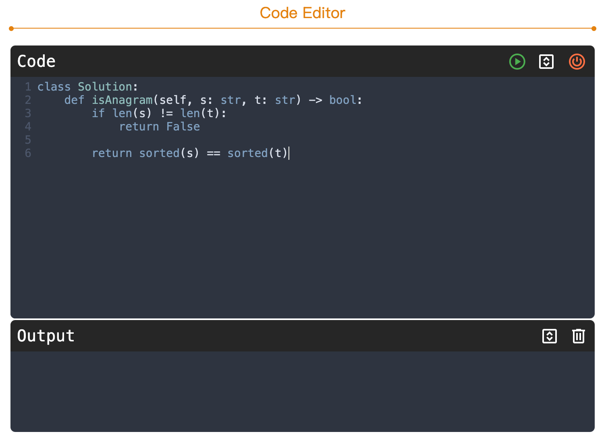
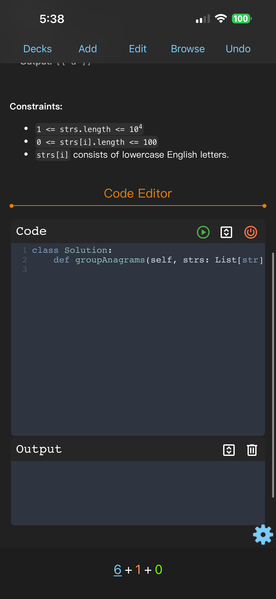
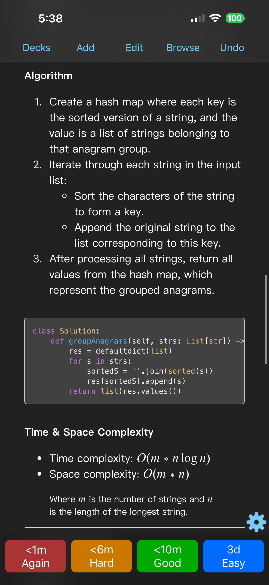
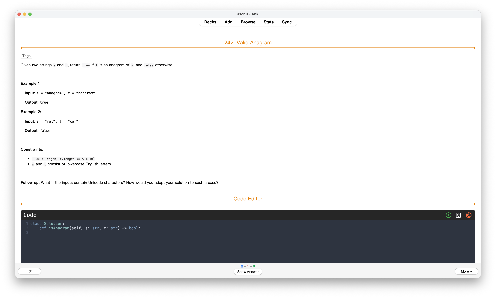
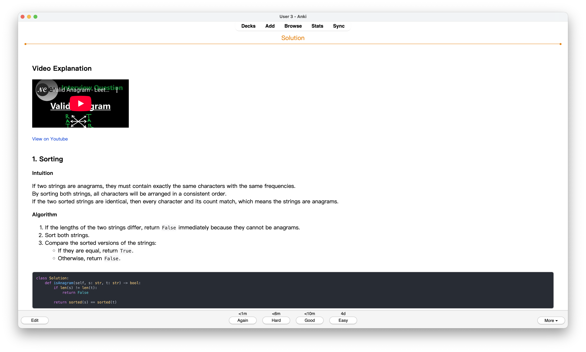

# Anki-NeetCode

Generate [Anki](https://apps.ankiweb.net) flashcards for NeetCode 150 problems with LeetCode questions and NeetCode solutions.

## Download

Download generated anki deck [Anki-NeetCode](https://github.com/krmanik/Anki-NeetCode/blob/main/Anki-NeetCode.apkg?raw=true)

## Notes

> It is recommended to turn off `Taps` and `Swipes` in AnkiMobile in `Settings -> Review -> Taps / Swipes`

## Features

- **150 LeetCode Problems**: Organized by topic from NeetCode's curated list
- **Detailed Solutions**: NeetCode video explanations embedded in cards
- **Code Editor**: Interactive Python code editor powered by Pyodide (runs in Anki)
- **Premium Problems**: Includes some LeetCode Premium questions from community sources
- **Organized Decks**: Questions grouped into topic-based subdecks

## Usage

1. Use `power` button to load `pyodide` in reviewer
2. Use `play` button to run the code




## Images

### AnkiMobile

|           front            |           back           |
| :------------------------: | :----------------------: |
|  |  |


### Anki

|           front            |           back           |
| :------------------------: | :----------------------: |
|  |  |


# Create your own deck

## Installation

### Prerequisites

```bash
# Python 3.8+
python --version

# Install required packages
pip install requests beautifulsoup4 selenium genanki
```

### Chrome WebDriver

Selenium requires ChromeDriver for web scraping.

## Usage

### 1. Extract NeetCode 150 List

1. Open https://neetcode.io/practice in your browser
2. Expand all question tables
3. Open DevTools Console and run:

```javascript
data = {}
for (table of tables) {
    table0 = table
    name = table0.childNodes[0].childNodes[0].childNodes[0].childNodes[0].innerText
    table00 = table0.childNodes[0].childNodes[0].childNodes[1].getElementsByTagName("table")
    console.log(name)
    data = {...data, [name]: {}}
    row = table00[0].getElementsByTagName("tr")
    for (tr of row) {
        if (!tr.childNodes[2].childNodes[1]) {
            continue
        }
        qname = tr.childNodes[2].innerText.trim()
        nurl = tr.childNodes[2].childNodes[0].href
        url = tr.childNodes[2].childNodes[1].href
        difficulty = tr.childNodes[3].innerText
        console.log(qname, nurl, url, difficulty)
        data[name][qname] = {nurl: nurl, url: url, difficulty: difficulty}
    }    
}

let a = document.createElement('a');
a.href = "data:application/octet-stream,"+encodeURIComponent(JSON.stringify(data));
a.download = 'neetcode-150-list.json';
a.click();
```

4. Save the downloaded `neetcode-150-list.json` to the project root

### 2. Fetch LeetCode Questions

Run the notebook cells to fetch question data from LeetCode's GraphQL API:

```python
# Extract all questions
for d in data:
    questions = data[d]
    for q in questions:
        url = questions[q]['url'].replace("problems", "graphql")
        get_q_json(url)
```

### 3. Fetch NeetCode Solutions

Scrape solution HTML from NeetCode using Selenium:

```python
driver = webdriver.Chrome()
for d in data:
    questions = data[d]
    for q in questions:
        nurl = questions[q]['nurl'].replace('?list=neetcode150', '/solution')
        get_solution_html(nurl, title_slug, driver)
driver.quit()
```

### 4. Get Premium Questions

Premium question descriptions are sourced from:
[Complete-LeetCode-Premium-Problems](https://github.com/AkashSingh3031/Complete-LeetCode-Premium-Problems)

Place the markdown files in `data/paidOnly/` directory.

### 5. Generate Anki Deck

Run the final cell to create `Anki-NeetCode.apkg`:

```python
# Creates organized subdecks
genanki.Package(decks).write_to_file('Anki-NeetCode.apkg')
```

### 6. Import to Anki

1. Open Anki Desktop
2. File → Import → Select `Anki-NeetCode.apkg`
3. Study!

## Deck Structure

```
Anki - NeetCode/
├── 01. Arrays & Hashing
├── 02. Two Pointers
├── 03. Sliding Window
├── 04. Stack
├── 05. Binary Search
├── 06. Linked List
├── 07. Trees
├── 08. Heap / Priority Queue
├── 09. Backtracking
├── 10. Tries
├── 11. Graphs
├── 12. Advanced Graphs
├── 13. 1-D Dynamic Programming
├── 14. 2-D Dynamic Programming
├── 15. Greedy
├── 16. Intervals
├── 17. Math & Geometry
└── 18. Bit Manipulation
```

## Card Features

- **Front**: Problem description, hints (collapsible), code editor with starter code
- **Back**: NeetCode solution (video + code walkthrough)
- **Code Editor**: Run Python code directly in Anki using Pyodide
- **Tags**: Automatically tagged by topic (array, hash-table, etc.)

## Credits

- [NeetCode](https://neetcode.io/) - Problem list and solutions
- [LeetCode](https://leetcode.com/) - Problem descriptions
- [Complete LeetCode Premium Problems](https://github.com/AkashSingh3031/Complete-LeetCode-Premium-Problems) - Premium problem descriptions
- [LeetCode-Anki](https://github.com/Peng-YM/LeetCode-Anki) - Card Templates
- [pyodide](https://github.com/pyodide/pyodide) - Python in browser
- [pycodeditor](https://github.com/krmanik/pycodeditor) - Python Code Web Editor using [CodeMirror](https://github.com/codemirror/codemirror5)
