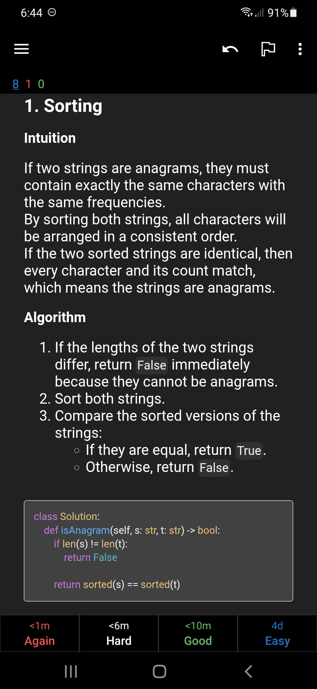

# Anki-NeetCode

[Anki](https://apps.ankiweb.net) flashcards for NeetCode 150 problems with LeetCode questions and NeetCode solutions.

## Download

Download generated anki deck:
- [Anki-NeetCode](https://github.com/krmanik/Anki-NeetCode/blob/main/Anki-NeetCode.apkg?raw=true) - Standard deck with solutions
- [Anki-NeetCode-Pro](https://github.com/krmanik/Anki-NeetCode/blob/main/Anki-NeetCode-Pro.apkg?raw=true) - Pro deck with test cases and test runner

#### Download from AnkiWeb
- [Anki-NeetCode](https://ankiweb.net/shared/info/1706794991) - Standard deck with solutions

## Notes

> It is recommended to turn off `Taps` and `Swipes` in AnkiMobile in `Settings -> Review -> Taps / Swipes`

## Features

- **150 LeetCode Problems**: Organized by topic from NeetCode's curated list
- **Detailed Solutions**: NeetCode video explanations embedded in cards
- **Code Editor**: Interactive Python code editor powered by Pyodide (runs in Anki)
- **Test Runner (Pro)**: Automated test cases with detailed feedback on pass/fail results
- **Premium Problems**: Includes some LeetCode Premium questions from community sources
- **Organized Decks**: Questions grouped into topic-based subdecks

## Import to Anki

1. Open Anki Desktop
2. File → Import → Select `Anki-NeetCode.apkg`
3. Study!

## Deck Structure

```
Anki - NeetCode/
├── 01. Arrays & Hashing
├── 02. Two Pointers
├── 03. Sliding Window
├── 04. Stack
├── 05. Binary Search
├── 06. Linked List
├── 07. Trees
├── 08. Heap / Priority Queue
├── 09. Backtracking
├── 10. Tries
├── 11. Graphs
├── 12. Advanced Graphs
├── 13. 1-D Dynamic Programming
├── 14. 2-D Dynamic Programming
├── 15. Greedy
├── 16. Intervals
├── 17. Math & Geometry
└── 18. Bit Manipulation
```

## Usage

1. Use `power` button to load `pyodide` in reviewer
2. Use `play` button to run the code
3. Use `test` button (Pro deck only) to run test cases and validate your solution


## Images

### Anki

|           front            |           back           |
| :------------------------: | :----------------------: |
|  |  |

### AnkiMobile

|           front            |           back           |
| :------------------------: | :----------------------: |
|  |  |

### AnkiDroid

|           front            |           back           |
| :------------------------: | :----------------------: |
|  |  |

## Credits

- [NeetCode](https://neetcode.io/) - Problem list and solutions
- [LeetCode](https://leetcode.com/) - Problem descriptions
- [Complete LeetCode Premium Problems](https://github.com/AkashSingh3031/Complete-LeetCode-Premium-Problems) - Premium problem descriptions
- [LeetCode-Anki](https://github.com/Peng-YM/LeetCode-Anki) - Card Templates
- [pyodide](https://github.com/pyodide/pyodide) - Python in browser
- [pycodeditor](https://github.com/krmanik/pycodeditor) - Python Code Web Editor using [CodeMirror](https://github.com/codemirror/codemirror5)
- [LeetCodeDataset-v0.3.1-train](https://github.com/newfacade/LeetCodeDataset) - LeetCode Training and Evaluation Dataset
